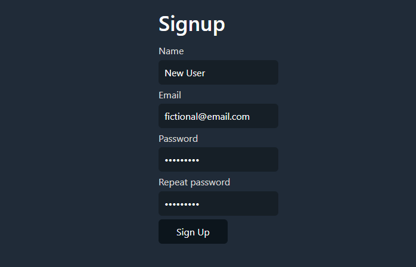

# **🌐 Secure PHP User Authentication Form**  

This project is a **fully functional user authentication system** built with **PHP** and **MySQL**, enabling users to **register and log in securely** using their email and password. To enhance security, **password hashing** is implemented, ensuring that user credentials remain protected.  

The form includes **real-time validation** using **JustValidate**, providing instant feedback to users and preventing submission errors. Additionally, it features **error handling**, displaying clear messages if required fields are left blank or incorrect credentials are entered.  

This project showcases **secure authentication practices**, **form validation**, and **database integration**, making it a solid foundation for user login systems in web applications.  

---

# **🛠️ Main Features**  
✅ **PHP & MySQL Integration** – Store and manage user data securely  
✅ **Password Hashing** – Protects user credentials  
✅ **JavaScript Validation (JustValidate)** – Ensures real-time input validation  
✅ **User Authentication** – Secure login system with error handling  

---

# **📷 Screenshots**
## Signup page

## Login page

## Home page

